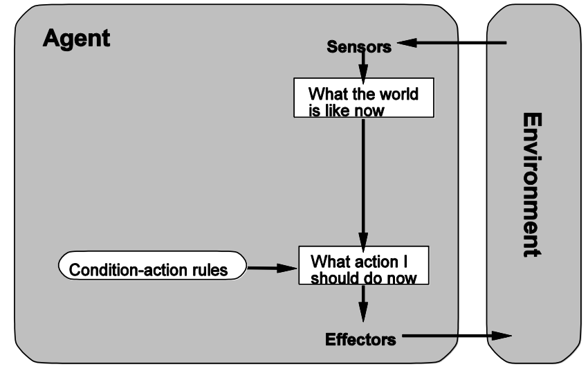
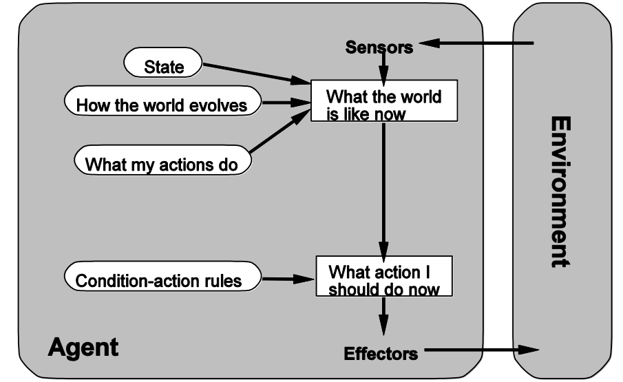
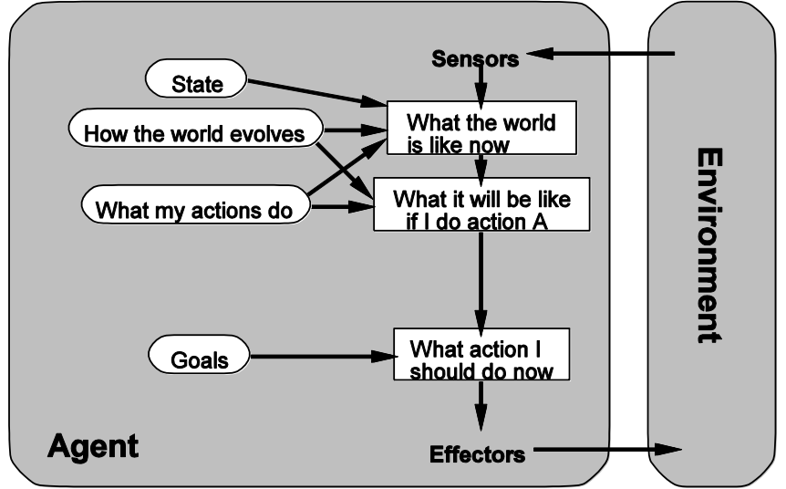

### What is AI?

- Thinking 
  - Like a human
    - Cognitive modelling
  - Rationally
    - Study of logic
      - If A $\implies $ B, and B $\implies$ C, then A $\implies$ C
- Acting
  - Like a human
  
    - Turing test, where
      - not reproducible
      - constructive or amenable to mathematical analysis
  
  - Rationally
  
    - Perform actions which will (most likely) achieve one's goal
    - Knowledge may not be perfect
      - Go beyond strict rational thought in general
  
    

### Intelligent Agents

> **<u>Percepts/observations</u>** of the environment, made by sensors
>
> **<u>Actions</u>** which may affect the environment, made by actuators
>
> **<u>Environment</u>** in which the agent exists
>
> **<u>Performance measure</u>** of the desirability of environment states

- Agent model examples
  - Automated taxi
    - Percepts
      - video
      - GPS
    - Actions
      - steer
      - accelerate
    - Environment
      - City streets
    - Performance measure
      - Safety
      - Reach destination

- Agent as functions
  - Agent is a function from <u>percept sequences</u> to actions
  - Ideal rational agent would pick actions which are expected to maximise its **<u>performance measure</u>**
    - Based on the percept sequence and its build-in knowledge

### Agent type

- Simple reflex agents
  - 
  - These agents select actions on the basis of the **<u>current percept</u>**, ignoring the rest of the percept history
  - It is simple but very useful in some cases
  - Procedures
    1. Find the current state
    2. Find the matched rule
    3. Return the action defined by the matched rule
  - Limitations
    - Works on if the environment is **<u>fully observable</u>**
    - Since it does not have memory, it is very hard to tell the current situation, for example, the car is turning right or left
- Model-based reflex agents
  - 
  - Keep track of the part of the world it can't see now.
    - It maintains some **<u>internal state</u>** that depends on the percept history reflects at least some of the **<u>unobserved aspects</u>** of the current state.
  - We need
    1. Some information about how the world evolves independently of the agent
    2. Some information about how the agent's actions affect the world
  - Procedures
    1. Use the most recent state info and action it does, combining with the current percept and model it has to determine the current state.
    2. Find the rule based on current state
    3. Return the action defined by the current rule
  - Limitations
    - Uncertainty about the current state may be unavoidable but the agent still has to make a decision

- Goal-based agents
  - 
  - Knowing the current state is not enough, the agent needs some sort of goal information that describes situations that are desirable.
  - It involves the consideration of future.
  - Although it is less efficient, it is **<u>more flexible</u>** because the knowledge that supports its decisions is represented explicitly and can be modified.
    - We don't need to rewrite the model if the outside world shifted.
- Utility-based agents
  - 
  - Goals alone are not enough to generate high-quality behavior in most environments.
    - We want to measure how happy is our customer.
    - Traving in a much longer router could also make our customers reach the destination, but they might not be vary happy.
  - Also useful when,
    - There are **<u>conflicting goals</u>**, only some of which can be achieved (for example, speed and safety), the utility function specifies the appropriate tradeoff.
    - There are several goals that the agent can aim for, none of which can be achieved with certainty, utility provides a way in which the likelihood of success can be weighed against the importance of the goals.
      - It guarantee that it will choose the way that most likely leads us to success.

### Environment Types

|   Positive    |              Negative               |
| :-----------: | :---------------------------------: |
|  Observable   | Partially Observable/Non-observable |
| Deterministic |    Non-deterministic/Stochastic     |
|   Episodic    |             Sequential              |
|    Static     |               Dynamic               |
|   Discrete    |             Continuous              |

- Observable
  - Percept contains all relevant information about the world
- Deterministic
  - Current state of the world uniquely determines the next
- Episodic
  - Only the current or recent percept is relevant
- Static
  - Environment doesn't change while the agent is deliberating
- Discrete
  - Finite number of possible percepts/actions