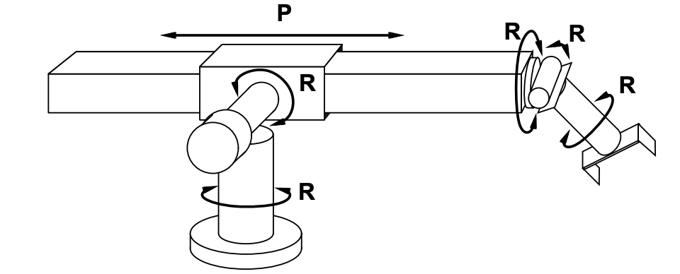
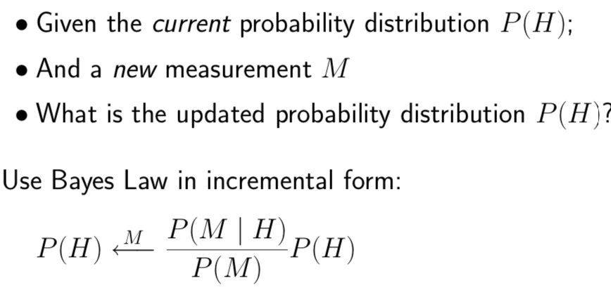
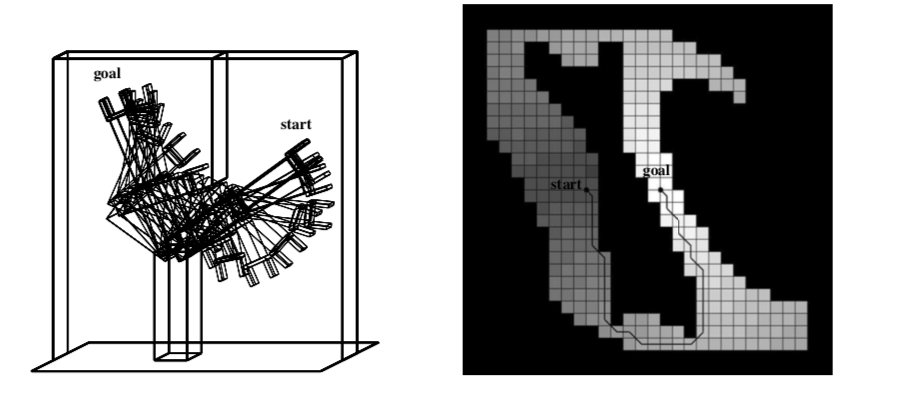
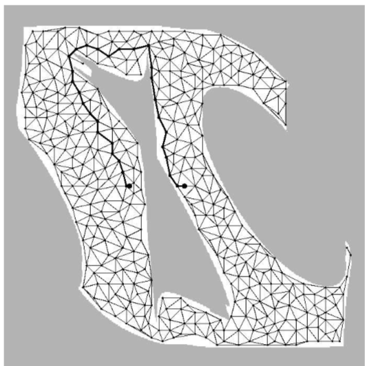

### Robotics

- Holonomic
  - 6 degrees of freedom
    - 
    - Where 6 is also the minimum number required to position end-effector arbitrarily
- Non-holonomic
  - Car has more DOF (3) than controls (2)
- Two major sources of uncertainty
  - Percepts
  - Actions

### Localization and Mapping

- Localization
  - Given **<u>map</u>** and **<u>observed landmarks</u>**, update position distribution
  - Sensor model
    - Use observation $h(x_t)$ of landmark $x_i,y_i$ to estimate state $x_t$ of robot
  - Motion Model
    - Update states using its movements $v_t \triangle_t$ and $\mathcal{w}_t\triangle_t$
  - Can use particle filtering to produce approximate position estimate, starting with random samples from uniform prior distribution for robot position. Update likelihood of each sample using sensor measurements. Resample according to the updated likelihood.
  - Uncertainty of the robot's state grows as it moves until we find a landmark
    - Assume that landmarks are identifiable

- Mapping
  - Given **<u>position</u>** and **<u>observed landmarks</u>**, update map distribution
- Simultaneous Localization and Mapping (SLAM)
  - Given observed landmarks, update both pose and map distribution
  - Probabilistic formulation
    - Add landmark locations $L_1,…L_k$  to the state vector, proceed as for localization

### Bayesian Inference on Sensors

- To determine whether an obstacle is there, given multiple measurements from a sensor
- Bayes Law in incremental form / Bayesian update rule
  - 

### Motion Planning

- Cell decomposition
  - Divide up space into simple cells
  - Each of which can be traversed “easily”
  - 
  - Problems
    - Some path disappear
  - Solution
    - Recursive decomposition of mixed cells
- Skeletonization
  - Identify finite number of easily connected points/lines that form a graph such that any two points are connected by a path on the graph
  - Voronoi diagram
    - Locus of points equidistant from obstacles
    - Problem
      - Doesn't scale well to higher dimensions
    - Solution
      - A probabilistic roadmap is generated by generating random points in C-space and keeping those in free space, create graph by joining pairs by straight lines
      - Problem
        - Need to generate enough points to ensure that every start/goal pair is connected through the graph
        - 