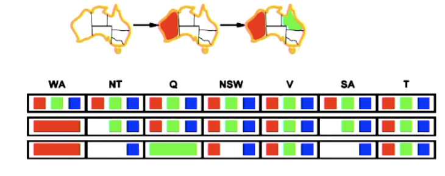

### Back track

- How to speed up the backtrace search

  - Minimum remaining values (MRV)
    - Choose the variable with the fewest legal values
  - Use degree heuristic (can act like a tie-breaker)
    - Choose the variable with the most constraints on remaining variables.
  - Least constraining value
    - Choose the one that will remain us more options

- Forward checking

  - Keep track of how many possible solution left for each state
  - 
  - 
  - SA and NT are neighbor but left same color
  - We need to propagate our choice further instead of only their neighbors.

- Constraint propagation

  - Arc consistency

    - X $\to$ Y is arc consistent iff for each of them at least have one value that satisfies the constraint between X and Y
    - If X loses a value, neighbors of X need to be rechecked.
    - 
      - Remove the condition that could not be satisfy

  -  Too slow, what to do?

    - Split into connected component, reduce time complexity dramatically

    - Turn graph to tree

      - Use topological sort and then start the AC(arc consistency) check from the bottom node and its parent(s).

      - How to form a tree from a graph?
        - Cutset conditioning
        - Initiate a point and cut it from the graph, then we can get a tree
          - 
        - But find the minimal set of point is a NP-hard problem

    - Local search

      - Using hill-climbing and min-conflicts heuristic which make selection with the least number of violation
      - Tries to change one variable assignment at a time.
      - Really fast, can solve n-queen problem in linear time