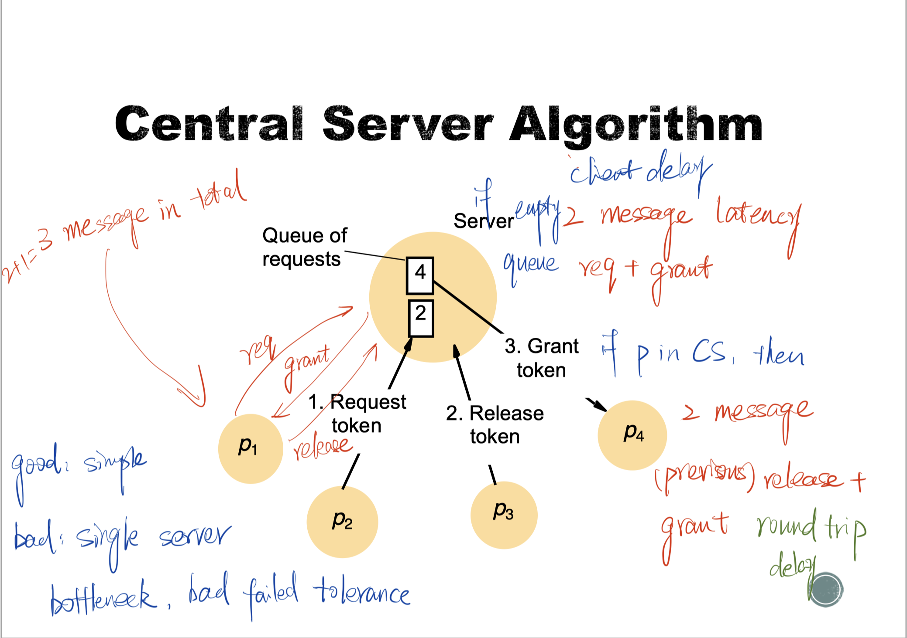
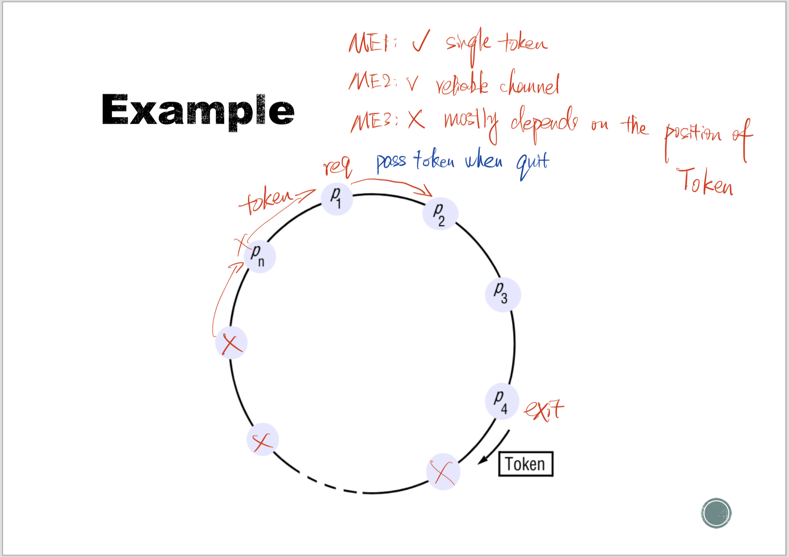
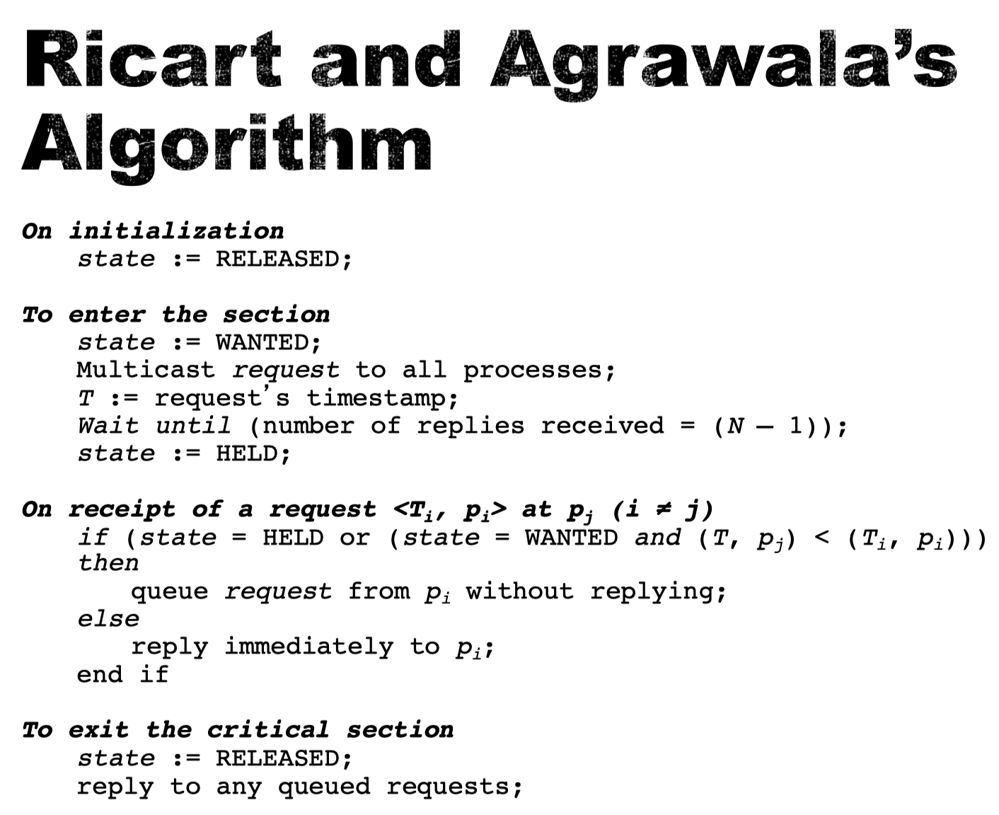
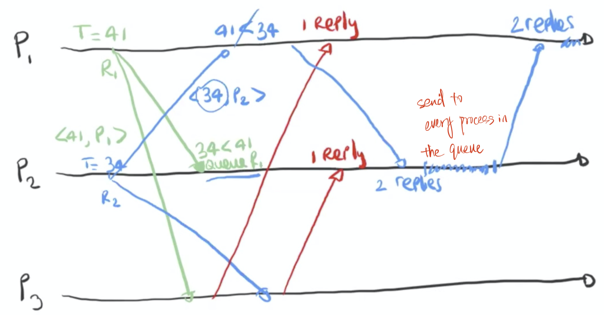
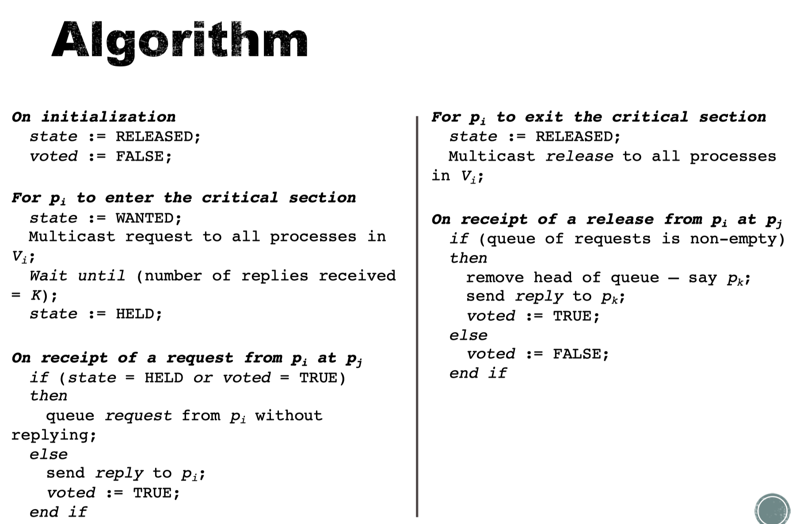

# Coordination and Agreement

## Aims

- For a set of processes in a distributed system (even in the presence of failures) to
  - Coordinate their actions to achieve common goals
  - Agree on values
- Topics
  - Failure detection
  - Mutual exclusion
  - elections
  - Group communication (multicast)
  - Consensus

## Failure Detection

- Unreliable failure detector

  - When queried about a process, produces on of two values

    - Unsuspected

      - The detector has recently received evidence suggesting that the process has not failed
      - a message was recently received from it
      - May be inaccurate, the process may have failed since then
      - Or just connection failed

    - Suspected

      - The detector has some indication that the process may have failed

      - no message received in quite some time

      - May be inaccurate, for example, the process could be functioning

        correctly, but the communication link is down, or it could be running more slowly than expected

  - Implementation

    - Periodically, every $T$ seconds each process $p$ sends a heart beat message to every other process
    - If a local failure detector at q does not receive heart beat message from p within T+D (D = estimated maximum transmission delay), then p is suspected.
    - If message is subsequently received, p is declared OK

  - Problems

    - For small D, intermittent network performance downgrades will lead to suspected nodes

    - For large D crashes will remain unobserved (crashed nodes will be

      fixed before timeout expires)

  - Solution

    - Variable $D$ that reflects the observed network latencies

- Reliable failure detector

  - Unsuspected
    - Potentially inaccurate as in unreliable detector
    - We cannot 100% sure about if the process is not failed since the failure message may still on the way but the process actually crashed already.
  - Failed
    - Accurate determination that peer process has failed
  - Only possible in synchronous network

  

## Mutual Exclusion

### Assumptions

- There is only once critical section
- The system is asynchronous
- Message delivery is reliable and messages are delivered intact
- Processes do not fail

### Application level protocol

- enter()
  - Enter critical section
  - Block if necessary
- ResourceAccess()
  - Access shared resources in critical section
- exit()
  - Leave critical section
  - Other processes may now enter

### Conditions

- ME1 (Safety)
  - At most one process may execute in the critical section at a time
- ME2 (Liveness)
  - Requests to enter and exit the critical section eventually succeed
  - No deadlocks or starvation
- ME3 ($\rightarrow$ Ordering)
  - Request first, enter first

### Evaluations

- Bandwidth consumption
  - Number of messages required per CS execution
  - Number of messages that it take to enter the CS + Number of message that it takes to exit the CS
- Client delay
  - The delay incurred by a process at each enter and exit operation
- Throughput
  - Rate at which the processes can access the CS = 1/(SD+E)
  - E = average time spent in critical section
  - SD = Synchronization Delay
    - Time interval between one process exiting the CS and the next process entering it (when only one process waiting)
    - 
  - Throughput is greater when the synchronization delay is shorter

### Central Server Algorithm

- 

- Pros
  - simple
- Cons
  - Single server bottleneck
  - Bad failure tolerance
- Latency
  - If queue empty, 2 message latency
    - Request + grant
  - If someone(P) in CS
    - P release + grant the next one in the queue
    - Round trip delay

### Ring-Based Algorithm

- Procedure
  - Pass a token (in one direction) around a ring
  - Ring is logical, not necessarily physical link
    - Every process $p_i$ has connection to process $p_{(i+1)\ mod\ N}$
  - Token arrival
    - Only process in possession of token may access critical region
    - Pass token on to neighbor if
      - No request upon arrival of token
      - When exiting critical region
- 
  - ME1
    - Yes
    - as single token at anytime
  - ME2
    - Yes
    - as we assume reliable channel
  - ME3
    - No
    - Sequence are mostly depends on the position of the token
- Performance
  - Bandwidth
    - Constant bandwidth consumption
    - The algorithm wastes bandwidth if no process requests the token
  - Client delay
    - Best acse
      - 0 message transmission delays
    - Worst case
      - N message transmission delays
  - Synchronization delay
    - Best case
      - 1
      - The next process to enter the CS is the the next one to pass the token
    - Worst case
      - N-1
      - The next process to enter is the process is the one just behind the current process in the ring

### Ricart and Agrawala's

- 

- 

- 

- ME conditions
  - ME1
    - Yes
    - Two processes $p_i$ and $p_j$ can only access critical section at the same time if both replied straight away to each other
    - But pairs $<T_i, p_i>$ are totally ordered, one process has to place the other in the queue
  - ME2
    - Yes
    - All other N-1 processes will eventually reply
  - ME3
    - Yes
    - Requests with lower Lamport timestamps are granted earlier

- Performance
  - Message complexity
    - Expensive access, requires $2(N-1)$ messages
    - $(N-1) \text{ req} + (N-1) \text{ reply}$
  - Client delay
    - Roundtrip time of request and reply
    - Only need the message from the process before it
      - So it is 1  RTT
  - Synchronization delay
    - Just one message transmission time
    - Process send reply to the first process in the queue

### Maekawa’s Voting Algorithm

- Mian idea
  - A process does not request permission from all other processes, but only from a subset of the processes
- Processes are grouped into voting sets
  - Voting sets have at least one overlapping process
- A process must collect sufficient votes to enter the CS
  - From all processes in its voting set
- Processes in the intersection of 2 voting sets ensure ME1
  - Because they cast their votes for only one candidate

#### Voting set

- Rules
  - For N processes $p_1,...,p_n$, voting sets $V_1,...,V_n$ are chosen such that
  - Any two voting sets overlap
  - $p_i’s$ voting set is $V_i$, so $p_i$ must be in $V_i$
  - fairness
    - All voting sets have equal size
  - Each process $p_j$ is contained in $K$ of the voting set $V_i$

- Optimization goal
  - Minimize K while achieving mutual exclusion
  - Achieved when $K \approx \sqrt{N}$
  - We should first choose $K$ and then calculate $N=K(K-1)+1$
- Optimal voting sets
  - Non-trivial to calculate, approximation
    - Derive $V_i$ so that $|V_i| \approx 2\sqrt{N}-1$
  - Place processes in a $\sqrt{N}$ by $\sqrt{N}$ matrix
  - Let $V_i$ the union of the row and column containing $p_i$
  - 

#### Alogrithm

#### Discussion

- ME1
  - Yes
  - If two processes could enter a critical section at the same time, then the processes in the non-empty intersection of their voting sets would have granted access to both which is impossible since all processes make at most one vote after receiving request.
- Extensions for satisfying ME2 and ME3

  - Modification to ensure absence of deadlocks
  - Use of <u>logical clocks</u>
    - processes queue requests in happened-before order

- Deadlocks are possible
  - 

#### Performance

- Bandwidth utilization
  - $2K(2\sqrt N)$ Per entry, $\sqrt N$ per exit, total $3\sqrt N$
  - Better than Ricart and Agrawala (for N > 4)
- Client delay
  - One round trip time
  - Same as for Ricart and Agrawala
- Synchronization delay
  - Round-trip time
    - release+request
  - Instead of single-message transmission time in Ricart and Agrawala

## Failure

- None of the covered algorithms can tolerate a crash failure
- Ring-algorithms
  - Cannot tolerate a single crash failure
- Central-Server
  - Tolerates crash failures of a node that has neither requested access nor is currently in the critical section
- Ricart and Agrawala’s algorithm
  - Tolerate crash failures if we assume that a failed process grants all requests implicitly
  - Requires reliable failure detector

- Maekawa’s algorithm
  - Tolerates crash failures if process is in a voting set not required, rest of the system not affected