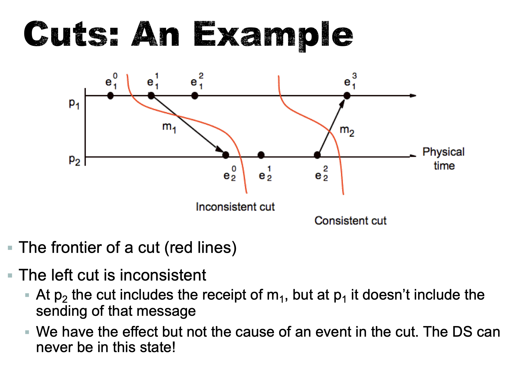
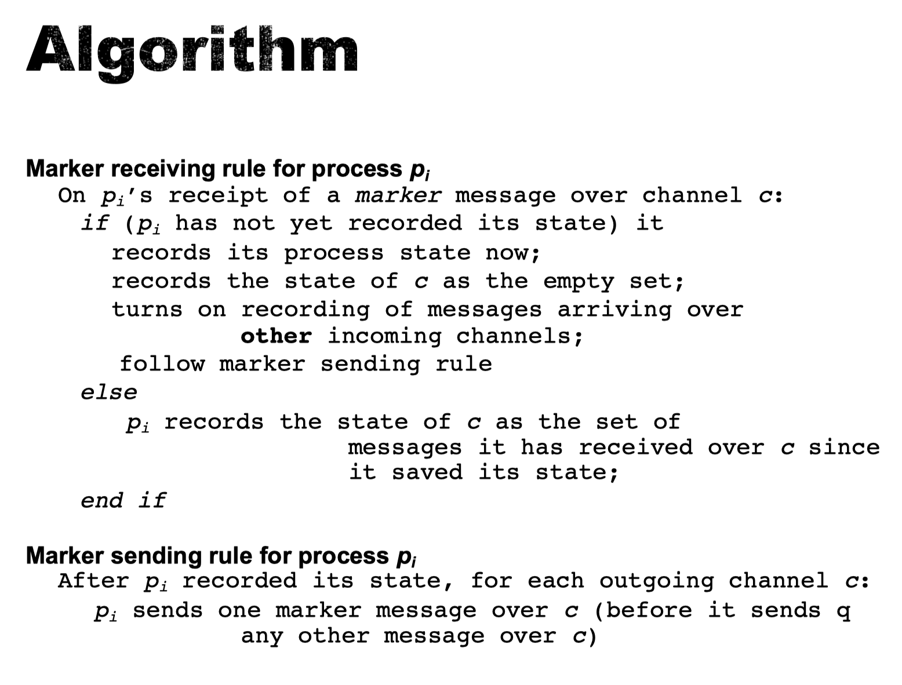
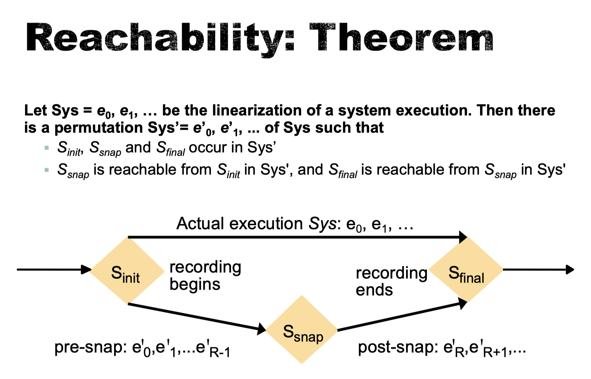

# Global States

## Premise

- Physical time cannot be perfectly synchronized in a distributed system
- No possible to gather the global state of the system at a particular time

## Aim

- Determine whether a particular property is true of a distributed system as it executes

## Approach

- Use logical time to construct a global view of the system state

## Motivation

- Distributed garbage collection
  - Are there references to an object anywhere in the system?
- Distributed deadlock detection
  - Is there a cycle in the graph of the “waits for” relationship between processes?
- Distributed termination detection
  - Has a distributed algorithm terminated?
- Distributed debugging
  - Give two processes $p_1$ and $p_2$ with variables $x_1$ and $x_2$ respectively, can we determine whether the condition $|x_1-x_2|>\delta$ is true.

## Definitions

- History of process $p_i$ was defined as
  - $h_i=<e^0_i, e^1_i,...>$
- A prefix of a history is defined as
  - $h^k_i=<e^0_i, e^1_i,..., e^k_i>$
- A global history of a system of N processes $p_0$ to $p_{N-1}$
  - $H = h_0 \cup h_1 \cup ... \cup h_{N-1}$
- State
  - To capture messages in the communication channel
  - Each process records sending of receipt of messages as part of their state

## Cut

### Definitions

- A cut of the system’s execution
  - Subset of its global history that is a union of prefixes of process histories
- Frontier of a cut
  - The last event in each process
- Consistent cut
  - If event in a cut, what caused that event should also in the cut
  - For all events e and e’
    - $e \in C$ and $e’ \rightarrow e \implies e’ \in C$

- 

## Global States

- Global state
  - Set of states of the individual process
    - $S=(s_0,s_1, ..,s_{N-1})$
  - The state $s_i$ of $p_i$ corresponds to the state of $p_i$ immediately after the last event before the cut
- Consistent global state
  - A global state that corresponds to a consistent cut
  - The local state of each process immediately after the events in the frontier of the cut (last event processed by p in the cut)
- The execution of a DS evolves through consistent global states
- The global state changes whenever an event happens
  - Process sends message
    - 
  - Process receives message
    - 
  - Process takes a step
    - 
- Moving from (consistent global) state to (consistent global) state obeys happened-before relation.

## Runs and linerizations

- The execution of distributed system can be seen as a series of transitions between global states
  - $S_0 \rightarrow S_1 \rightarrow S_2 \rightarrow ...$
- Each transition corresponds to one event in one process
  - If two events occur simultaneously, they must be concurrent and we can place them in either order.
- Run
  - Total ordering of all the events in a global history that is consistent with each process’ local history ordering ($\rightarrow_p$)
- Linearization -- consistent run
  - Ordering of events in a global history that is consistent with the happened-before relation ($\rightarrow$)
  - Only pass through consistent global state
- Reachable state
  - A state $S’$ is reachable from another state S if there is a linearization through these states

## Snapshots

- A snapshot of an execution of a distributed algorithm
  - Record a consistent global state
- A snapshot consists of
  - A local snapshot of the state of each process
  - The channel state of messages in transit for each channel
- Use of snapshots
  - Restarting after a failure
  - Off-line determination of stable properties
    - Which remain true as soon as they have become true such as deadlocks, garbage objects
  - Debugging

### Chandy-Lamport Snapshot Algorithm

- Logic
  - Uses a control message called a marker
  - Marker separates messages in the channels
    - Send marker to every outgoing channel before anything else
      - After a process has recorded its state
    - A marker separates the messages in the channel into those to be included in the snapshot from those not to be recorded in the snapshot
    - Starting to record the state if receives a marker from any channels
- Assumptions
  - Neither channels nor processes fail
    - Communication is reliable
  - Channels are unidirectional and messages arrive in order (FIFO)
  - There is a path between any two processes
    - Strongly connected network
  - Any process can initiate the snapshot algorithm
  - The processes can continue to work while the snapshot takes place
  - Basic an control messages
    - Distinguish basic messages from control messages
- 
- Algorithm initiation
  - Assume process $p_i$ initiates the snapshot
  - $p_i$ records its own state
  - $p_i$ Prepares a special marker message
    - Control message
  - $p_i$ sends the marker message to all other processes
    - Using $N-1$ outbound channels
  - Start recording all incoming messages from all incoming channels

- Algorithm Termination
  - All processes have received a marker on all the $N-1$ incoming channels
    - And recorded their states

 

#### Consistency

- Snapshots taken by the Chandy-Lamport Algorithm correspond to consistent global states

- Can be proofed by contradiction

  

#### Reachability

- $S_{init}$
  - The global state immediately before the first process recoded its state
- $S_{final}$
  - The global state when the snapshot algorithm terminates
- $S_{snap}$
  - The recorded global state
- 

- 

- 

- Sys’ is reorder of Sys by making all the pre-snap events before post-snap events