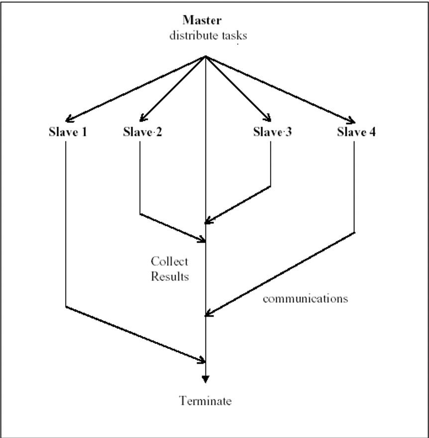
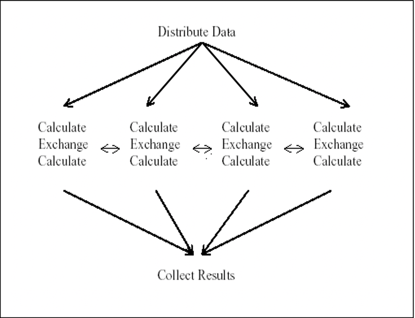
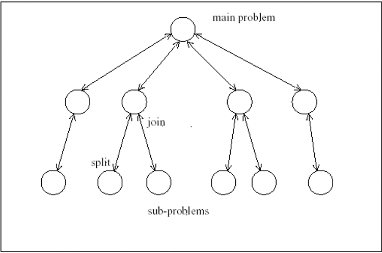

# Week3 - Overview of Distributed and Parallel Computing Systems

## Compute Scaling

- Vertical computational scaling
  - Have faster processors
    - n GHz CPU to 2n
    - Easy to do, but costs more
  - Limits of fundamental physics, Moore’s law no longer working
- Horizontal computational scaling
  - Have more processors
    - Easy to add more processors, cost increase not so great
  - but hard to 
    - Design
    - Develop
    - Debug
    - Deploy
    - Test
    - Manage
    - Understand
- Network scaling
  - Volume of data on network grows each year
- Multiple Add mores
  - Single machine multiple cores
    - Typical laptop/PC/server these days
  - Loosely coupled collection/cluster of machines
    - Polling/sharing of resources
      - Dedicated vs available only when not in use by others
  - Tightly coupled cluster of machines
    - Typical HPC/HTC set-up (SPARTAN)
      - Which many servers in same room, often with fast message passing interconnects
  - Widely distributed clusters of machines
    - UK NGS, EGEE
  - Hybrid combination of the above
    - Leads to many challenges with distributed systems
      - Shared state
      - Delayed and lost in message passing

## If n processors are thrown at a problem how much faster will it go?

### Common Terminologies

- $T(1) = \text{time for serial computation}$
- $T(N) = \text{time for N parallel computation}$
- $S(N) = \frac{T(1)}{T(N)} \text{ which is the speed up}$ 
- Proportion of speed up depends on parts of program that cannot be parallelised

### Amdahl’s Law

- Basic Terms
  - $\sigma: \text{The time that costs by non-parallelisable part}$
  - $\pi :\text{The time that costs by parallelisable part}$
  - $N: \text{The number of processors}$
  
- $T(1) = \sigma + \pi: \text{Time for serial computation without enhanced by parallelism}$  

- $T(N) = \sigma + \frac{\pi}{N}: \text{Time for N parallel computations with max enhanced by parallelism}$

- $S = \frac{T(1)}{T(N)} = \frac{\sigma + \pi}{\sigma + \pi/N} = \frac{1 + \pi/\sigma}{1+(\pi/\sigma)\times(1/N)}$

- $\pi/\sigma = \frac{1-\alpha}{\alpha} \text{: Time proportion between cost on parallelisable part and unparallelisable part}$ 
  
  - $\alpha$ is the fraction of running time that sequential program spends on non-parallel parts of a computation 
  
- $S = \frac{1 + (1-\alpha)/\alpha}{1+(1-\alpha)/(N\alpha)} = \frac{1}{a + (1-\alpha)/N}\approx \frac{1}{\alpha}$ When $N$ is large

- That is, if 95% of the program can be parallelized, the theoretical maximum speedup using parallel computing would be 20$\times$, no matter how many processors are used.

- If the non-parallelisable part takes 1H, then no matter how many cores are used, it won’t complete in < 1H

- Over-simplified real world scenario

  - As it assumes a fixed problem size

  

### Gustafson-Barsis’s Law

- Different Terminologies
  - $\pi :\text{Fixed parallel time per process}$
- $T(1) = \sigma + N\pi: \text{Time for serial computation without enhanced by parallelism}$
- $T(N) = \sigma + \pi: \text{Time for N parallel computations with max enhanced by parallelism}$
- $S(N) = \frac{T(1)}{T(N)} = \frac{\sigma+N\pi}{\sigma+\pi} = \frac{\sigma}{\sigma+\pi}+\frac{N\pi}{\sigma + \pi}$
- $\pi/\sigma = \frac{1-\alpha}{\alpha} \text{: Time proportion between cost on parallelisable part and unparallelisable part}$
- $S(N) = \alpha+N(1-\alpha)=N-\alpha(N-1)$
- Speed up S using N processes is given as a linear formula dependent on the number of processes and the fraction of time to run sequential parts
- It does not assume a fixed size problem, which conclude, 
  - More parallel equipment available, larger problems can be solved in the similar time

### Past Exam

- [2016 Q2 B] A parallel program takes 120 seconds to run on 8 processors. The total time spent in the sequential part of the program is 12 seconds. What is the scaled speedup? [2]
  - $\sigma = 12 \text{ and } \pi=120-12=108$
  - $S(N) = \frac{12+8*108}{12+108}=7.3$
  - Scaled speedup is 7.3
- [... Q2 C]
  -  7.3 times faster, or
  - $(7.3*120) - 120 = 6.3*120 = 756$ Seconds faster
- [... Q2 D] why theoretical?
  - Since extra overhead are introduced due to parallelisation, including
    - Communications
    - Extra variables introduced to deal with parallel aspects
    - loops in parallisim

### Comparison

**<u>Amdahl’s Law</u>** suggests that with limited task, speed up could not be too fast. <u>**Gustafson-Barsis’s Law**</u> suggests that with enough processors and remaining tasks, speed up will always meet the requirement.

## Computer Architecture

### Simplest level

- CPU for executing programs
- Memory that stores/executing programs and related data
- I/O systems
- Permanent storage for read/writing data into out of memory
- HPC needs to keep balance of these
  - Based on the problem needs to be solved

### Data Combination

|               | Simple Instruction | Multiple Instruction |
| ------------- | ------------------ | -------------------- |
| Single Data   | SISD               | MISD                 |
| Multiple Data | SIMD               | MIMD                 |

- Single Instruction, Single Data Stream (SISD)
  - Single control unit fetches single instruction stream from memory
  - Sequential computer which exploits no parallelism in either the instruction of data streams
- Multiple Instruction, Single Data stream (MISD)
  - <u>**Parallel**</u> computing architecture where many functional units (PU/CPU) perform different operations on the same data
  - Example 
    - fault tolerant computer architectures, multiple error checking on the same date source
- Single Instruction, Multiple Data Stream (SIMD)
  - Multiple processing elements that perform the same operation on multiple data points simultaneously
  - Focusing on data level parallelism, only a single process (instruction) at a given moment(**Concurrency**)
  - Example
    - to improve performance of multimedia use such as for image processing
- Multiple Instruction, Multiple Data stream (MIMD)
  - Number of processors that function **asynchronously** and independently.
  - Machines can be shared memory or distributed memory categories.
    - Depends on how MIMD processors access memory
  - Example
    - HPC

## Approaches for Parallelism

### Explicit vs Implicit Parallelisation

- Implicit Parallelism
  - **<u>Compiler</u>** is responsible for identifying parallelism and scheduling of calculations and the placement of data
  - Pretty hard to do
- Explicit Parallelisation
  - **<u>Programmer</u>** is responsible for most of the parallelization effort

### Hardware

- Multiple cores that can process data and perform computational tasks in parallel.
- To address the issue that CPU not doing anything whilst waiting for caching. Many chips have mixture cache L1 for single core, L2 for pair cores and L3 shared with all cores.

### Operating System

- Compute parallelism
  - Processes
    - Used to realize tasks, structure activities
  - Theads
    - Native threads
      - Fork, Spawn, Join
    - Green threads
      - Scheduled by a VM instead of natively by the OS
- Data parallelism
  - Caching

### Software/Applications

- Programming language supports a range of parallelisation/concurrency features
  - Threads, thread pools, locks, semaphores ...
- Key issues
  - Deadlock
    - Processes involved constantly waiting for each other
  - LiveLock
    - Process constantly change with regard to one another, but none are progressing

## Problem of Distributed Systems (Challenges)

### Reliability

- Data may or may not eventually arrived
- Data may or may not be the one you send

### Latency

- <u>**Latency**</u> means that the time cost by transmission. 
- Latency becomes more and more significant if distance become further.
- In system with many nodes/hops each link can have different latencies

### Bandwidth Limit

- Cannot send any amount of data between any two nodes

### Network Insecure

- SQL injections
- Man in the middle attacks
- Masquerade
- Trojans/Viruses

### Topology may change

- **Topology** means that the route taken from source to destination. Routine selected will decide:
  - Latency
  - IP
  - Service
- Routine is not fixed unless specific routing protocols selected.

### There are many administrator

- There should be one for each module

### Transport cost

- You can’t send as much data as you like for free

### Network is heterogeneous

- There are multiple approaches to design parallel or distributed systems
- No single algorithm
- No single technical solution
- Eco-system of approaches explored over time and many open research questions/challenges

### Time is not the same for everyone

- NTP synchronizes participating computers to within a few milliseconds of Coordinated Universal Time(UTC).

### Past Exams

- [2016 Q1] Cloud computing does not solve the fundamental challenges associated with large-scale distributed systems. Discuss. [8]
  1. We still cannot have a global clock for each individual servers
  2. Network latency still exist
  3. Data transport still costly
  4. No global clock (time ubiquitous)
  5. We need to have a open interface for illegitimate user interact with us but the network is still insecure, namely network security and reliability problem still exist.
  6. Bandwidth is still a limited resource, we can’t send request and get responds as quick as we want in some cases from the user perspective.
  7. Network is heterogeneous
- What are the problem that does solved by Cloud computing?
  1. Scalability and elastic scaling
  2. Easier software deployment process through snapshots/scripted deployments
  3. More tools has been offered, including load balancer.
  4. Geospatially distributed and easy to migrate applications 

## Design Stages of Parallel Program

### Partitioning

- Decomposition of the original task into smaller one
- Strategies
  - Master-worker/task farming
    - Master decomposes the problem into small tasks, distributes to workers and gathers partial results to produce the final result
    - 
  - Single-Program Multiple-Data (SPMD)
    - common exploited model(Mapreduce). 
    - The main idea is that each process executes the same piece of code, but on different parts of the data.
    - 
  - Pipeline
    - Suitable for applications involving multiple stages of execution that typically operate on large number of data sets
    - 
  - Divide and conquer
    - A problem is divided into two or more sub problems, and each of these sub problems are solved independently, and their results are combined.(eg: merge sort)
    - Like master-worker while master doing both split and join operation
    - 
  - Speculation
    - Used when it is quite difficult to achieve parallelism through the previous paradigms
    - Like look ahead, if the data is predictable, we could use the predicted data to do the following action while waiting for data.
    - If the prediction is incorrect, we have to take corrective action.

### Communication

- Flow of information and coordination among tasks that are created in the partition stage

### Agglomeration

- Tasks and communication created in above stages are evaluated for performance and implementation cost

### Mapping/Scheduling

- Assign tasks to processors such that job completion time is minimized and resource utilization is maximized