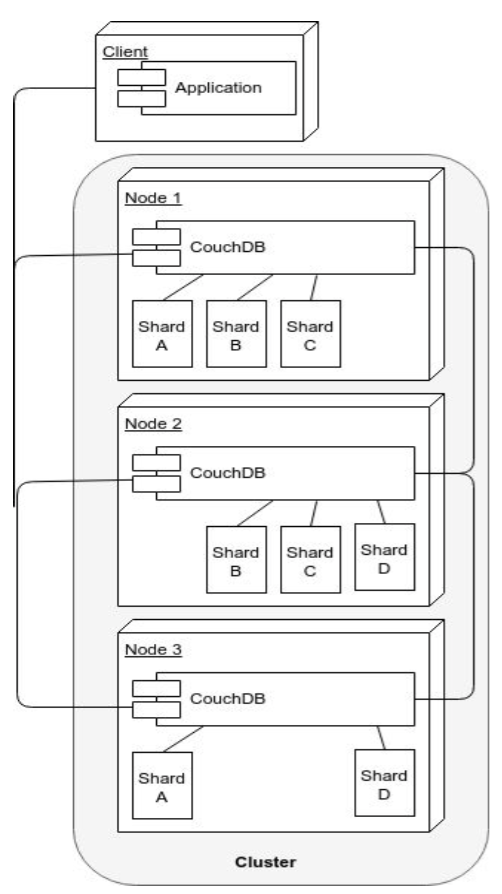
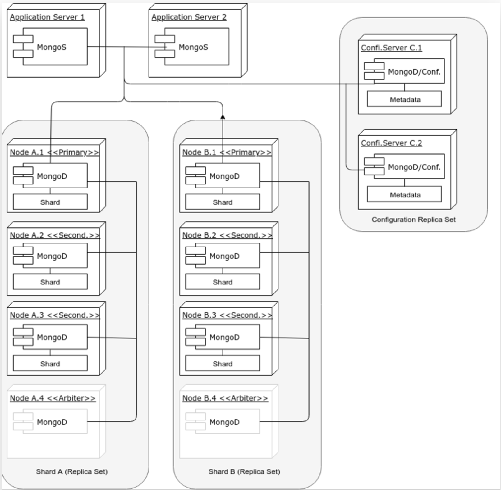
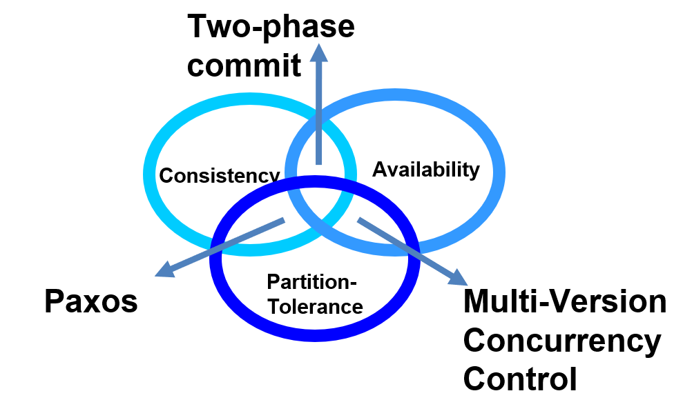

# Week 7 - Big Data and CouchDB

## Big data challenges

### Properties

- Four Vs
  - Volume
    - volume is one of most important criteria
  - Velocity
    - The frequency at which new data is being brought into the system and analytics performed
  - Variety
    - The variability and complexity of data schema.
    - The more complex the data schemas you have, the higher the probability of them changing along the way, adding more complexity.
  - Veracity
    - the level of trust in the data accuracy(provenance)
    - the more diverse sources you have, the more unstructured they are, the less veracity you have

### Why we need NoSQL DBMSs / Why document-oriented DBMS for big data

- Relational database finds it challenging to handle such huge data volumes. To address this, RDBMS added more central processing units (or CPUs) or more memory to the database management system to scale up vertically

- While relational DBMSs are good at ensuring consistency, they rely on normalized data models that, in a world of big data can no longer be taken for granted
- The majority of the data comes in a semi-structured or unstructured format from social media, audio, video, texts, and emails.
- Big data is generated at a very high velocity. RDBMS lacks in high velocity because it’s designed for steady data retention rather than rapid growth

### DBMSs for Distributed Environments

- A key-value store is a DBMS that allows the retrieval of a chunk of data given a key
  - Fast but crude
  - example
    - Redis
    - PostgreSQL
- A BigTable DBMS stores data in columns grouped into column families, with rows potentially containing different columns of the same family
  - Example
    - Apache Cassandra
    - Apache Accumulo
- A document-oriented DBMS stores data as structured documents, usually expressed as XML or JSON
  - Example
    - Apache CouchDB
    - MongoDB

### Clustered NoSQL DBMS Comparison

- Clusters needs to
  - Run over multiple connected computers
  - Distribute the computing load over multiple computers. (eg. for availability) 
  - Store multiple copies of data. (eg. to achieve redundancy)

## Architectures

### Shard

- Sharding
  - Partitioning of a database “horizontally” (the database rows or documents) are partitioned into subsets that are stored on different servers. 
  - Every subset of rows is called a shard.
- Number of shards
  - Larger than the number of replica
  - The max number of nodes = the number of shards
- Advantages of shards
  - Load balance
    - Improve the performance through the distribution of computing load across nodes
  - Make it easier to move data files around
    - When adding new nodes to cluster
- Strategy of shards
  - Hash sharding
    - Distribute evenly across the cluster
  - Range sharding
    - Similar rows are stored on the same node

### Replication

- The action of storing the same row (or document) on different nodes to make the database fault-tolerant
- Replication and sharding can be combined with the objective of maximizing availability while maintaining a minimum level of data safety

### Partitions

- A grouping of logically related rows in the same shard
  - All the tweets of the same user
- Partitioning improves performance by restricting queries to a single shard
- To be effective, partitions have to be relatively small
  - Certainly smaller than a shard
- A databases has to be declared partitioned during its creation

### CouchDB Cluster

- 
- All nodes answer requests (read or write) at the same time
- Sharding (splitting of data across nodes) is done on every node
- When a node does not contain a document, the node requests it from another node and returns it to the client
- Nodes can be added/removed easily, and their shards are re-balanced automatically upon addition/deletion of nodes
- The graph contains 3 nodes, 4 shards and a replica number of 2
- Quorums
  - Write
    - Can only complete successfully if the document is committed to a quorum of replicas, usually a simple majority
  - Read
    - Can only complete successfully only if a quorum of replicas return matching documents

### MongoDB Cluster

- 
- Sharding is done at the replica set level, hence it involves more than one cluster.
- Every data node in a Replica set contains the complete shard data
- The configuration nodes contain the metadata that map documents to replica sets. The partitioning algorithm uses a configurable shard key field to distribute data across Replica Sets
- Only the primary node in a replica set answers write requests, but read requests can depending on the specifics of the configuration.
  - Be answered by every node (including secondary nodes) in the set
- Updates flow only from the primary to the secondary
- If a primary node fails, or discovers it is connected to a minority of nodes, a secondary of the same replica set is elected as primary
- Arbiters
  - MongoDB instances without data
  - Can assist in breaking a tie in elections
- Data are balanced across replica sets
- Since a quorum has to be reached, it is better to have an odd number of voting members

### MongoDB vs CouchDB

|                | MongoDB                                                      | CouchDB                                                      |
| -------------- | ------------------------------------------------------------ | ------------------------------------------------------------ |
| complexity     | Higher                                                       | Lower                                                        |
| Availability   | Lower                                                        | Higher                                                       |
| Accessibility  | MongoDB software routers must be embedded in application servers | Can connected by any HTTP client                             |
| Data Integrity | Losing two primary nodes in the MongoDB in this example implies losing write access to half the data, and possibly read access too, depending on the cluster configuration parameters and the nature of the lost node (primary or secondary) | Losing two nodes out of three in the CouchDB example implies losing access to 1/4 of data |
| Functionality  | Some features, such as unique indexes, are not supported in MongoDB sharded environments other than *obviously* the document id. | Can support this                                             |
| CAP            | <u>**Two-phase commit**</u> for replicating data from primary to secondary. **<u>Paxos-like</u>** to elect a primary node in a replica-set. | MVCC                                                         |

## CAP Theorem

- Consistency
  - every client receiving an answer receivers <u>the same answer</u> from all nodes in the cluster
- Availability
  - Every client receives <u>an answer</u> from any node in the cluster
- Partition-tolerance
  - The cluster <u>keeps on operating</u> when one or more nodes cannot communicate with rest of the cluster
  - “Hard” network partitions may be rare, but “soft” ones are not (a slow node may be considered dead even if it is not)

### Two phase Commit -- Consistency and Availability

- This is the usual algorithm used in relational DBMS’s (and MongoDB)
- Procedures
  - Phase 1
    - Each server that needs to commit data writes its data records to the log. If a server is unsuccessful, it responds with a failure message. If successful, the server replies with an OK message. 
  - Phase 2
    - This phase begins after all participants respond OK. Then, the coordinator sends a signal to each server with commit instructions. After committing, each writes the commit as part of its log record for reference and sends the coordinator a message that its commit has been successfully implemented.
  - Aborts transaction when a partition is detected
- Reduced availability
  - Data lock
  - Stop in case of partition
- Enforce consistency
  - Every database is in a consistent state, and all are left in the same state
- Conclusion
  - Therefore, two-phase commit is a good solution when the cluster is co-located, less good when it is distributed

### Paxos -- Consistency and Partition

- In Paxos, every node is either a proposer or an accepter
  - A proposer proposes a value with timestamp
  - An accepter can accept or refuse it
    - Refuse if the accepter receives a more recent value
- When a proposer has received a sufficient number of acceptances (a <u>quorum</u> is reached), and confirmation message is sent to the accepters with the agreed value
- Conclusion
  - Paxos cluster can recover from partitions and maintain consistency, but the smaller part of a partition will not send responses, hence the availability is compromised

### MVCC -- Availability and Partition-Tolerance

- A method to ensure availability, where every node in a cluster always accepts requests. 
- Some sort of recovery from a partition by reconciling the single databases with revisions (data are not replaced, they are just given a new revision number)
  - the transaction that completes last will get a higher revision number, hence will be considered as the current value.
- In MVCC, concurrent updates are possible without distributed locks
  - In optimistic locking only the local copy of the object is locked

- In case of cluster partition and concurrent requests with the same revision number  going to two partitioned nodes, both are accepted, but once the partition is solved, there would be a conflict. 
  - Conflict that would have to be solved somehow (CouchDB returns a list of all current conflicts, which are then left to be solved by the application)

## MapReduce Algorithms

### Properties

- Pioneered by Google, suitable for parallel computing of SIMD
- Map
  - Distributes data across machines
- Reduce
  - Summarizes them until the result is obtained.

### Advantages

- Naturally parallel processing
- Moving the process to where data are, greatly reducing network traffic as the data will usually be processed at the place it store.
- Good scalability which you could expand the job to thousands of nodes

