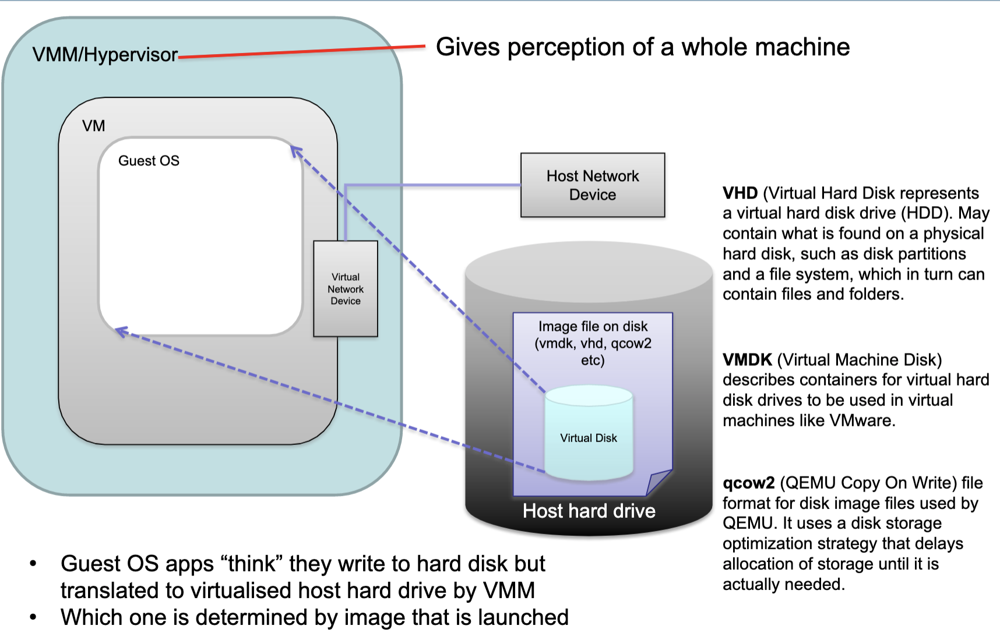
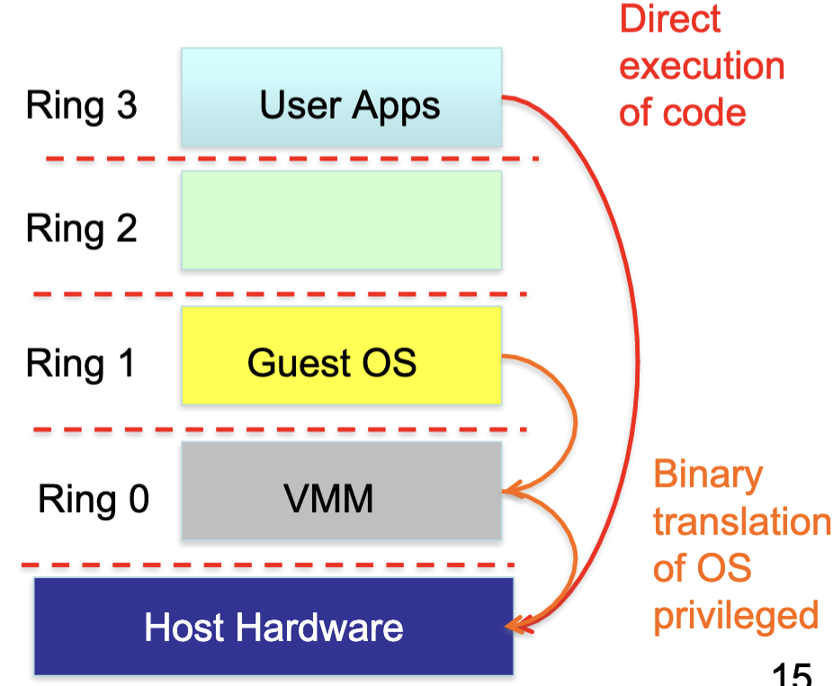
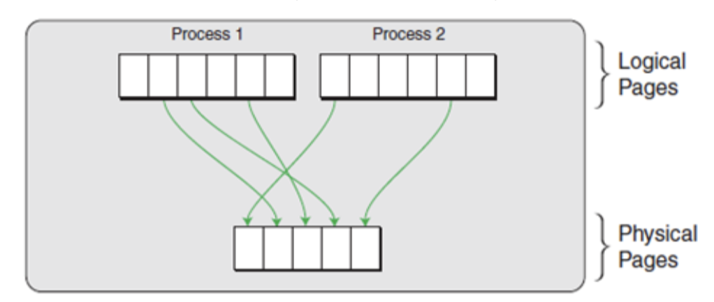
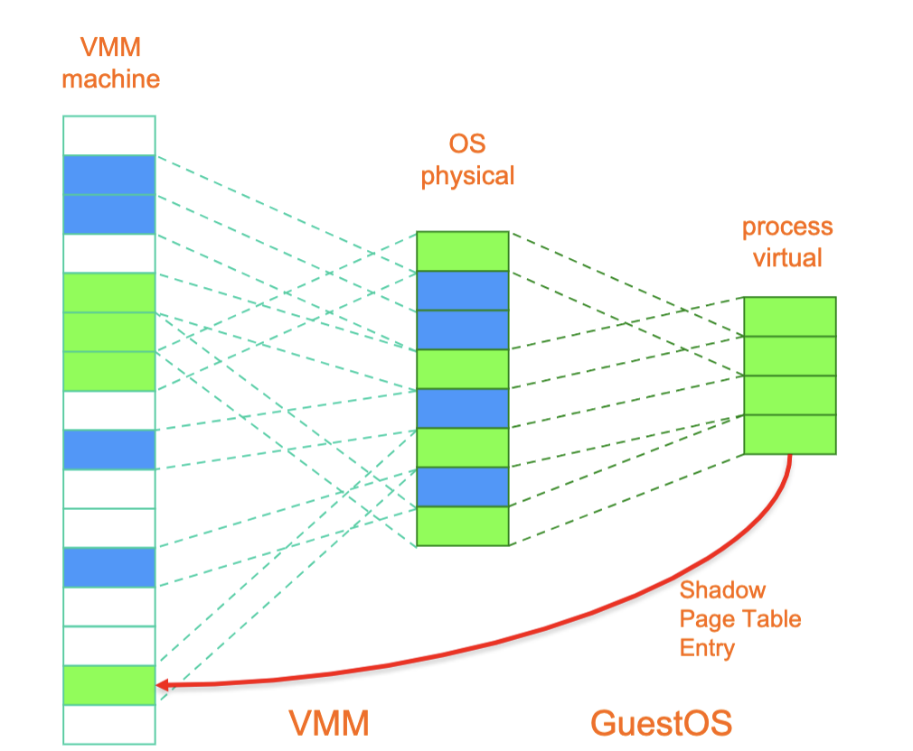
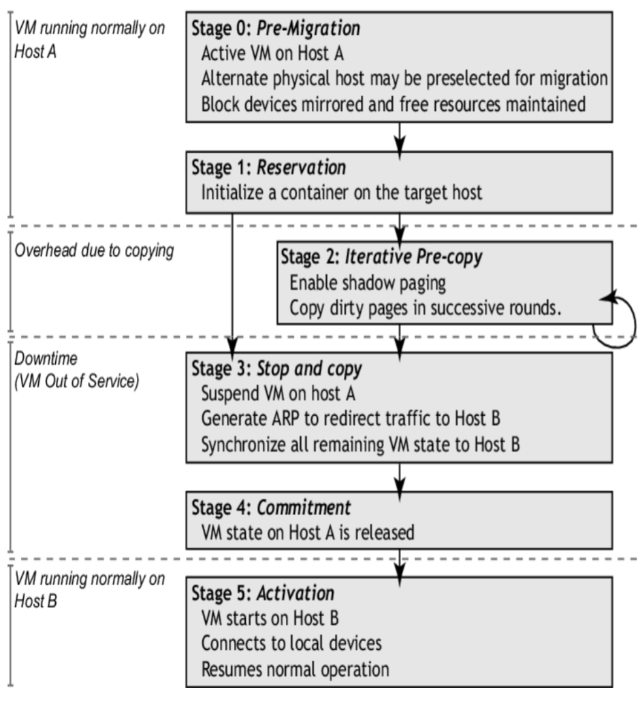

# Week 8.1 Virtualisation

## Terminology

- Virtual Machine Monitor(VMM) / Hypervisor
  - The virtualisation layer between the underlying hardware and the virtual machines and guest operating systems it supports
  - VM environment $\xrightarrow{\text{same environment}}$ physical machine
  - Minor decreases in performance only
  - Control of system resources
- Virtual Machine
  - A **<u>representation</u>** of a real machine using hardware/software that can host a guest operating system

- Guest Operating System
  - An operating system that runs in a virtual machine environment that would otherwise run directly on a separate physical system

- Context switching

  - Processes run in lower privileged mode
    - User mode
  - OS kernel runs in privileged kernel mode
  - OS typically virtualises memory, CPU, disk etc giving appearance of complete access to those to application process
    - Each process has illusion of access to some/all of the memory of the CPU, but actually across multiple processes
  - Context switches can catch **<u>sensitive calls</u>**

- In a VM

  - 

  - VHD (Virtual Hard Disk)
    - Represents a virtual hard disk drive. May contain what is found on a physical hard disk, such as disk partitions and a file system, which in turn can contain files and folders.
  - VMDK (Virtual Machine Disk)
    - It describes containers for virtual hard disk drives to be used in virtual machines like VMware
  - qcow2 (QEMU Copy On Write)
    - File format for disk image files used by QEMU. It uses a disk storage optimization strategy that delays allocation of storage until it is actually needed.

### Motivation

- Server Consolidation
  - Increased utilisation
  - Reduced energy consumption
- Personal virtual machines can be created on demand
  - No hardware purchase needed
  - Public cloud computing
- Security/Isolation
  - Share a single machine with multiple users
- Hardware independence
  - Relocate to different hardware
- Properties of interest
  - Fidelity
    - Software on the VMM executes behaviour identical to that demonstrated when running on the machine directly, barring timing effects
  - Performance
    - An overwhelming majority of guest instructions executed by hardware without VMM intervention
  - Safety
    - The VMM manages all hardware resources

### Classification of instructions

- Privileged Instructions
  - Instructions that trap if the processor is in user mode and do not trap in kernel mode
- Sensitive Instructions
  - Instructions whose behaviour depends on the mode or configuration of the hardware
  - Different behaviours depending on whether in user or kernel mode
- Innocuous Instructions
  - Instructions that are neither privileged nor sensitive
  - Including
    - Read data
    - Add two numbers
- Popek and Goldgberg Theorem

> For any conventional third generation computer, a virtual machine monitor may be constructed if the set of **<u>sensitive instructions</u>** for that computer is a subset of the set of **<u>privileged instruction</u>**.

- IA-32/x86 was not originally virtualisable
  - Due to **<u>sensitive instructions</u>** that could not be trapped
    - SMSW – storing machine status word
    - SGDT, SLDT – store global/local descriptor table register
    - POPF – interrupt flag
  - Intel and AMD introduced extensions to make x86 virtualisable
    - AMD SVM (Secure Virtual Machine)
    - Intel VT (Virtualisation Technology)

### Typical Virtualisation Strategy

- De-privileging (trap-and-emulate)
  - What is
    - VMM emulates the effect on system/hardware resources or privileged instructions whose execution traps into the VMM
  - How to achieve
    - Typically achieved by running GuestOS at a lower hardware priority level than VMM
  - Problem
    - Problematic on some architectures where privileged instructions do not trap when executed at de-privileged level
- Primary/Shadow structures
  - What is?
    - VMM maintains shadow copies of critical structures whose primary versions are manipulated by the GuestOS
    - Primary copies needed to insure correct versions are visible to GuestOS
- Memory traces (common strategy)
  - What is?
    - Controlling access to memory so that the shadow and primary structure remain coherent
  - Advantages
    - Write-protect primary copies so that update operations cause page faults which can be caught, interpreted and addressed
      - Someones app/code doesn’t crash the server you are using

### Aspects of VMM

#### Full virtualisation

- What is?
  - allow an unmodified guest OS to run in isolation by simulating full hardware (e.g. VMWare)
  - Guest OS has no idea it is not on physical machine
  - 
  - OS code will be trapped by VMM

- Pros
  - Guest is unaware it is executing within a VM
  - Guest OS need not be modified
  - No hardware or OS assistance required
  - Can run legacy OS
- Cons
  - Can be less efficient

#### Para-virtualisation

- What is?
  - VMM/Hypervisor exposes special interface to guest OS for better performance. Requires a modified/hypervisor-aware Guest OS (e.g. Xen)
  - Can optimise systems to use this interface since not all instructions need to be trapped/dealt with
  - 
  - OS instruction call directly to VMM layer and be replaced there
- Pros
  - Lower virtualisation overheads, so better performance, e.g. Xen
- Cons
  - Need to modify guest OS
  - Less portable
  - Less compatibility

#### Hardware-assisted virtualisation

- What is?
  - Hardware provides architectural support for running a Hypervisor
  - New processors typically have this
  - Requires that all sensitive instructions trappable
- Pros
  - Good performance
  - Easier to implement
  - Advanced implementation supports hardware assisted DMA, memory virtualisation
- Cons
  - Needs hardware support

#### Binary Translation

- What is?
  - Trap and execute occurs by scanning guest instruction stream and replacing sensitive instructions with emulated code
    - VMware
  - Do not need hardware support, but can be much harder to achieve

- Pros
  - GuestOS need not be modified
  - No hardware or OS assistance required
  - Can run legacy OS
- Cons
  - Overheads
  - Complicated 
  - Need to replace instruction “on the fly”
  - Library to help this
    - vCUDA

#### Bare Metal Hypervisor

- What is?
  - VMM runs directly on actual hardware (e.g. WMWare ESX server)
  - Boots up and runs on actual physical machine
  - VMM has to support device drivers, all HW

#### Hosted Virtualisation

- What is?
  - VMM runs on top of another operating system
  - VMWare Workstation

#### Operating System Level Virtualisation

- What is?
  - Lightweight VMs
  - Instead of whole-system virtualisation, the OS creates mini-containers
    - A subset of the OS is often good enough for many use cases
    - Akin to an advanced version of “chroot”
      - Operation that changes apparent root directory for current running process and subprocesses. Program run in such a modified environment cannot access files and commands outside that environmental directory tree. Aka a chroot jail
  - Examples
    - Docker
    - LXC
- Pros
  - Lightweight
  - Many more VMs on same hardware
  - Can be used to package applications and all OS
- Cons
  - Can only run apps designed for the same OS
  - Cannot host a different guest OS
  - Can only use native file system
  - Uses same resources as other containers

#### Memory Virtualisation

- Conventionally page tables store the logical page number and physical page number mappings
  - 
  - 

- In VMM case, VMM maintains shadow page tables in lock-step with the page tables. 
  - 
    - In this case, one OS represent in blue, the other in green
  - Additional management overhead is added.

#### Live migration

- Have continuity of service during data moving
- Steps
  - 

