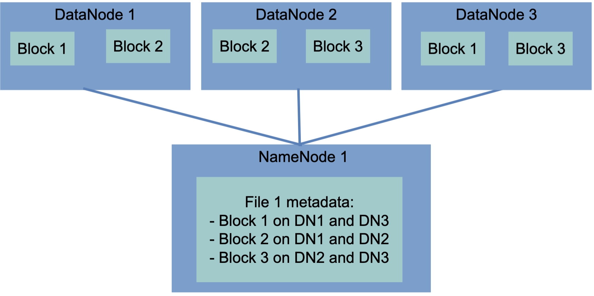
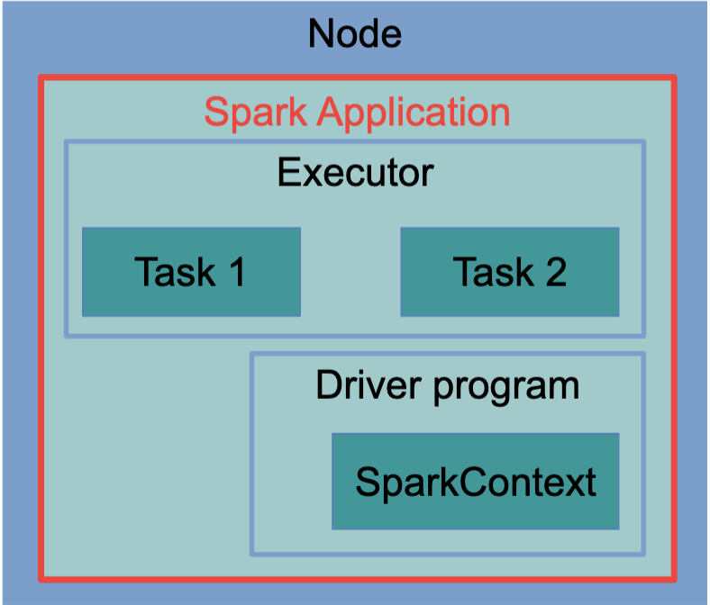
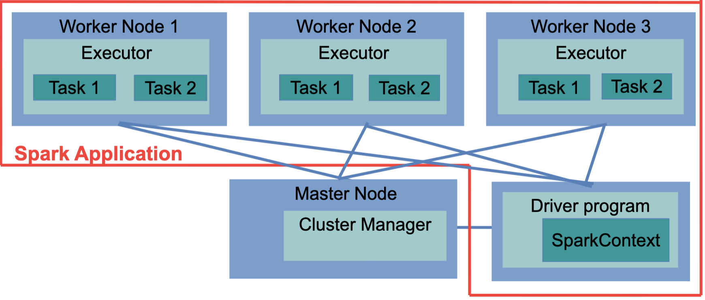

# Week9 - Big Data Analytics

## Introduction

### Why?

- There would not be much point in amassing vast amount of data without being able to analyse it,  hence the blossoming of **<u>large-scale</u>** business intelligence and more complex machine learning algorithms

- Overlapping among business intelligence, machine learning, statistics and data mining.
  - Just use big data analytics

### Examples / Usage

- Full-text search
  - Google search engine
- Aggregation of data
  - Summing up the number of hits by web-pages
- Clustering
  - Grouping customer into classes based on their spending habits
- Sentiment analysis
  - Deciding whether a tweet on a given topic express a positive or negative sentiment
- Recommendations
  - Suggesting additional products to a client during checkout based on the choices made by other clients who bought a similar product

### Challenges

- Need a framework for analysing big data has to distribute both data and processing over many nodes
  - Reading and writing distributed datasets
  - Preserving data in the presence of failing data nodes
  - Support MapReduce
  - fault-tolerant
  - Working in a cluster

### Available Tools

- There are many tools that can perform data analytics
  - stats
    - R, SAS, SPSS
  - Business intelligence tools
    - Tableau
    - Business Objects
  - Information retrieval tools
    - ElasticSearch
- When it comes to big data, the majority of applications are built on top of an open-source framework
  - Apache Hadoop

## Apache Hadoop

### HDFS (Hadoop Distributed File System)

- Core is fault tolerant file system that is designed to span many node
- HDFS has much larger blocks since
  - Reduce metadata size
    - Reduced need for memory to store information about the where the blocks are
  - More efficient use of the network
    - With a large block, a reduced number network connections needs to be kept open
  - Reduced need for seek operations on big files
  - Efficient when most data of a block have to be processed
- Structure
  - 

### Resource Manager -- YARN

- YARN deals with Executing MapReduce jobs on a cluster
  - It is composed of a central ***Resource Manager***
  - Many ***Node Managers*** that reside on slave machines
- Every time a MapReduce job is scheduled for execution on a Hadoop cluster, YARN starts an **<u>Application Master</u>** that negotiates resources with the **<u>Resource Manager</u>** and starts Containers on the slave nodes
  - Containers are the processes where the actual processing is done

## Apache Spark

### Why Spark (if we have Hadoop already)

- While Hadoop MapReduce works well, it is geared towards performing relatively simple jobs on large datasets.
- However, when complex jobs are performed, we would like
  - Caching data in memory
  - Having finer-grained control on the execution of the jobs
- Apache Spark was designed to 
  - reduce the latency inherent in the Hadoop approach for the execution of MapReduce job
- Spark can operate within the Hadoop architecture, using YARN and Zookeeper to 
  - Manage computing resources
  - Storing data on HDFS

### Architecture

- 

- Tightly-coupled nature of its main components
- Spark ships with a cluster manager of its own but can also work with others
  - MESOS
  - YARN

### Spark Runtime

- Applications in Spark are composed of different components including
  - Job
    - The data processing that has to be performed on a dataset
  - Task
    - A single operation on a dataset
  - Stage
    - Set of task operating on a single partition
    - A job is composed of more than one stage when data are to be transferred across node
  - Executors
    - The processes in which tasks are executed
  - Cluster Manager
    - The process assigning tasks to executors
  - Driver program
    - The main logic of the application
  - Spark application
    - Driver program + Executor
  - Spark Context
    - The general configuration of the job
- These different components can be arranged in **<u>three</u>** different deployment modes across the cluster

#### Local Mode

- In local mode, every Spark component runs within the same JVM. However, the Spark application can still run in parallel, as there may be more than on executor active
- Good for developing and debugging

#### Cluster Mode

- In cluster mode, every component, including the driver program, is executed on the cluster. Upon launching, the job can run autonomously. 
- This is the common way of running non-interactive Spark jobs.

#### Client Mode

- The driver program talks directly to the executors on the worker nodes. Therefore, the machine hosting the driver program has to be connected to the cluster until job completion.
- Client mode must be used when the applications are interactive, as happens in the Python or Scala Spark shells.

## Resilient Distributed Dataset(RDD)

### What is?

- RDDs are the way data are stored in Spark during computation
- RDD for
  - R $\rightarrow$ Resilient
    - Data are stored redundantly, hence, a failing node would not affect their integrity
  - D $\rightarrow$ Distributed
    - Data are split into chunks, and these chunks are sent to different nodes
  - D $\rightarrow$ Dataset
    - A dataset is just a collection of objects, hence very generic

### Properties

- <u>**Immutable**</u>, once defined, they cannot be changed
  - Greatly simplified parallel computations, and consistent with functional programming paradigm
- **<u>Transient</u>**, they meant to be used only once, then discarded
  - But they can be cached, if it improves performance
- **<u>Lazily-evaluated</u>**
  - Evaluation happens only when data cannot be kept in an RDD
    - When number of objects in an RDD has to be computed
    - When RDD has to be written to a file
    - **Not** during transformations

