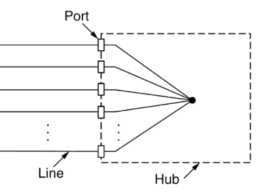
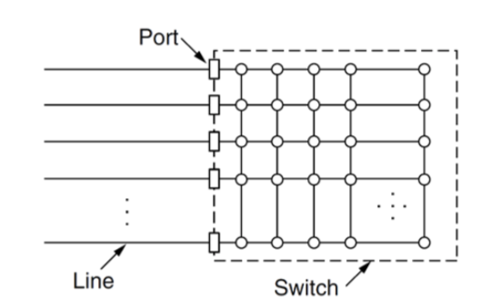
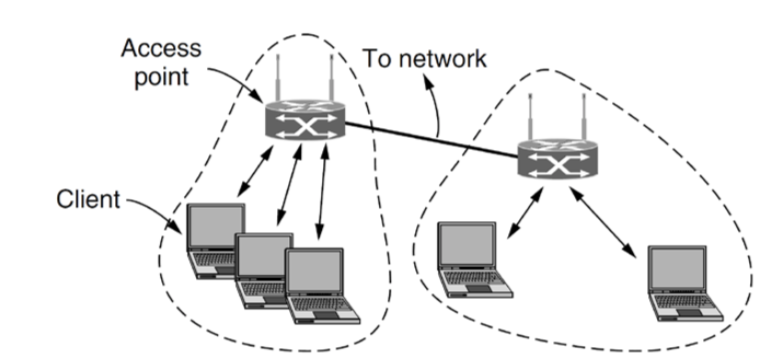

## Link Layer

- Services
  - Framing 
    - Parse a sequence of bits into frames
  - Error control
    - Correct bit errors, or discard error frames
  - Flow control
    - Stop sender sending if the receiver is not ready to receive
- Different with transport layers
  - point to point (two sides of a link)
  - **Not** end-to-end (over the whole network)

## Ethernet

### Hub

- 
- A wiring pattern based on running individual cables to each machine from a hub
- Mitigated wiring problems, but increased cabling complexity and cost
  - Particularly around the hub
  - Even though the cable was considerably thinner
- Hub acts as if all cables are soldered together, every frame that comes in is sent out along all other lines
- The message will be broadcasted to all other ports.
- Problems
  - Fixed capacity that is being shared by all hosts.
  - As the number of host increase their share of the network capacity is reduced dramatically.

### Bridges

- A bridge connects two LANs with the same “link-layer” protocol
  - Ethernet with ethernet
  - Wifi with WiFi
- Each side of a bridge is a separate “medium” and so bridges increase capacity
  - Each side could wait until other side finish the transmission
- Switch is a bridge connect many lands instead of only two
  - It could also connect with only one host

### Switched Ethernet

- 

- It could learn MAC address by monitoring incoming frame source address
  - Build a spanning tree and only routing on this tree to prevent form a ring.
- Received frames are only sent out on the relevant port for the destination
  - If destination unknown, in which case it is broadcast to all ports
- There are many links inside a switch which could help us to transfer frame between different ports really quickly (in Gbps)
  - Called backplane
    

### Hubs v.s. Switches

- Hubs have to manage collisions
  - If two ports want to send a frame at the same time they must use CSMA/CD to schedule transmissions to avoid a collision
    - Collision domain remains the entire network
- In a switch each part is its own collision domain
  - Provided the cable is full duplex, collisions are impossible
    - If half-duplex reverts to CSMA/CD

### Switched Ethernet Advantages

- Switches improve performance
  - No collisions, results in more efficient use of the network capacity
  - Multiple frame can be sent concurrently
    - Requires the switch to be able to buffer frames
  - Performance increase is often an order of magnitude over hubs
  - No CSMA/CD required which we could make a much longer segment sizes
    - The propagation delay could be much longer than packet duration (related to tutorial question 5)
- Security benefits
  - Prevents interfaces seeing other hosts' traffic

## Wireless LANs

- Increasingly popular networking technology
- Main standard is 802.11 (a,g,n,ac)
- 2 modes
  - Infrastructure Mode
    - Access points (nearly always)
    - 
  - Ad hoc Mode
    - Direct connection between computers
    - 
    
    

### 802.11 Channels

- 2.4 GHz Channels sharing 100 MHz of space
- Each channel is 20/22 MHz in width, with a 5 MHz divide between channels.
- Channels overlap, whit only 3 channels that do not (e.g. 1, 6, 11)
- Selecting channels other than those 2 is likely to lead to a negative impact on performance of your and other networks.
  
  - Works better with CSMA/CD
  
  

### 802.11 Frames

- There are three addresses
  - Sender
  - Receiver
  - Network ID (BSSID)
  - The sequence are depends on the mode
  
  

### Network discovery and Power Usage

- Why?
  - Many devices accessing WiFi are power constrained
- Network discovery is either Passive or Active
  - Passive
    - Listens for beacon frames
    - A full scan will take several seconds, which may need to be repeated at least every minute, becoming a significant power drain
    - contains
      - SSID
        - Network name
      - BSSID
        - Mac address of the AP
      - Security setting
        - Open, WEP, MAP, MAP2...
      - Channel
        - Which channel the SSID is operating on
      - Beacon interval
        - How often the AP sends out beacon frames
      - The Traffic Indication Map (TIM) and Delivery Traffic Indication Map (DTIM)
        - Technique for improved power management on devices, the devices can sleep and only wake up at intervals to find out if there is any data waiting for them , the AP buffers it until they are awake.
  - Active (commonly used today)
    - Device sends out a probe request
      - The AP response the same request as above
    - Contents
      - BSSID
        - Broadcast MAC address
      - SSID
        - Zero length or SSID the device has previously connected to
      - MAC
        - The device MAC address
      - Security setting
        - Available
      - Channel
        - Available
- If an AP sees a general probe request, or one for itself, it responds with a Prob response, similar in content to a beacon frame.

## CPU architecture

### Variables and RAM

- C variables are stored in RAM

- RAM is a huge 1-D array of bytes
  
  - We need to keep track of where in RAM each variable is kept
- Assembly language has its own named variables, not in RAM
  - Registers (only list some special one)
    - Program counter
      - Location of the currently executing command
        - What command we are up to
    - Flags
      - Many binary values like “last operation produced zero”
        - It is zero or none-zero output.
        - Do we have a carry?
- Stack
  - Why?
    - We would like a specific place to store C local variable apart from global variable
  - This will be cleared when we returned

- Von Neuman architecture
  - Code and data are both store in memory
  - Why dangers?
    
    - Code could edit other codes
    
      

### Executing an operation

- Procedure
  1. Fetch - Read instruction from RAM
  2. Decode - Work out what to do
  3. Execute - Do it
  4. Write - Put result back in register or RAM
- Each phase uses **different circuitry**
  - **Pipeline** is applied so that during decode we could starting to fetch the next instruction instead of simply waiting there.
    - Number of stages in pipeline is called its <u>depth</u>
  - What if we required some information from a unfinished instruction?
    - We stall the pipeline and wait until the previous instruction finished.
    - Or the compiler could help us to optimize our code (resolve the dependency and give those lines a bit more time to run)
    - Or modern CPU could also optimize it in micro-operation level
- Complex instructions
  - Sometimes execute a complex instruction may take longer time
  - What we do is to stall the pipeline and wait until this execution finish

### Compatibility and Microcode

- We use microcode to interpret what we are going to run
  - Just like java compile first and then run it on JVM
  - Which this layer called compatibility layer
- There are microarchitecture that for each process that represent different set of microcode
  - The microarchitecture is new for each new processor
  - But invisible to software

### Micro-operations

- Each instructions are divided into micro-operations
  - It does something very simple, e.g. present two register to arithmetic logic unit
- Microcode is stored in ROM on the CPU
- For machine language
  - Difference instructions take different amounts of time
    - Hard to pipeline
  - Different instructions have different lengths
    - Can't fetch next before starting to decode of this one
- For micro-operations
  - It is designed to be simple enough to fit into a cpu clock cycle

### Speculative execution

- Pipeline is interrupted by jumps - especially conditional jumps
  - Don't know which byte to fetch until previous command is executed
  - Cheapest option
    - stall
      - But not so efficient
  - Fastest option
    - Guess which will occur, which is **branch prediction**
- Guess which branch could be executed next and then do that one
  - Could guess randomly
  - Or we have a branch predictor to predict which branch is the most likely one and we execute that one
- No architectural effect, but micro-architectural effect
  - Affect the cache
  - Exploited by the Spectre attack

### Call Subroutine - create stack frame

- When a subroutine is called,
  - Program counter is pushed
  - Stack pointer (RSP) decreased to create a new stack frame
- Stack frame contains
  - Local variable 
  - Registered to be preserved
  - Return address
- To return from a subroutine
  - Undo the adjustment to RSP
  - Pop program counter from the stack

### Buffer overflow

- Common cause of pointer related crashes
- Worse Case
  - Can overwrite security-related variables like crypto keys
  - Can overwrite the return address
    - Causes process to execute arbitrary code
    - Bad when this process has high privileges
  - Common cause
    - Malicious user input
  - Execution of code that wasn't even written!
    - Since op codes and data are both are just bytes
      - Von Neuman architecture
    - Can be used for force the victim code to perform a sequence of operations that attacker wants
  
  

### RISC v.s. CISC

- Where RISC better
  - Many of these problems are avoided by Reduced Instruction Set Computers(RISC)
  - Each instruction has a fixed size, format and duration
    - No operation does more than one of
      - load
      - store
      - arithmetic
  - Easier to pipeline
    - Due to fix size
  - Less complex $\to$ less circuitry $\to$ lower power consumption
  - Popular in mobile phones (ARM CPUs)
- Drawback
  - Needs more operations, because each is simpler
    - More and faster RAM needed, more things need to be stored.
    - Deeper pipeline (refer to the tutorial question)
      - More likely to be interrupted
      - More likely to suffer from wrong branch prediction
- Comparison
  - RISC good for low-power
    - Compare mobile phone size and share life to notebook
  - CISC good for backward compatibility
    - Microcode hides the details of architectural changes
  - “Micro-engine” of CISC is similar to RISC