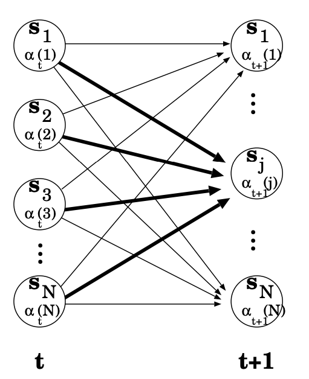
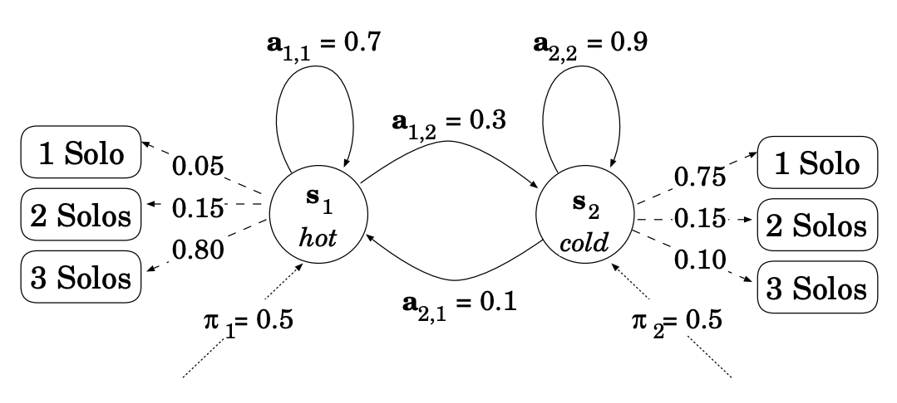
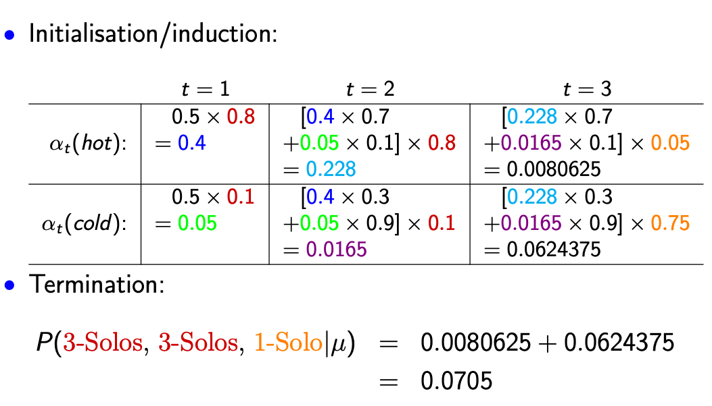

### Sequential Classification

- Structured classification model

  - Able to capture the interaction between instances

- Markov chain

  - 
  - Assumption
    - A state $q_i$ only depends on the immediately preceding state
    - $P(q_i|q_1…q_{i-1}) = P(q_i|q_{i-1})$

- Hidden Markov Models (HMM)

  - Different possibilities attached to each observation, rather than unique observation per state, which is we only see observations, but we want to know hidden states.

  - 

  - Independence Assumption

    - $P(o_i|q_1,..,q_i,o_1,…,o_{i-1}) = P(o_i|q_i)$

  - Foundation problems of HMM

    - Evaluation

      - Given an HMM $\mu$ and observation sequence $\Omega$ , determine the likelihood $P(\Omega|\mu)$

      - Formulas

        - Probability of the state sequence Q
          - $P(Q|\mu) = \pi_{q1}a_{q_1q_2}a_{q_2q_3}…a_{q_{T-1}q_T}$
        - Probability of observation sequence $\Omega $ for state sequence Q
          - $P(\Omega|Q,\mu)=\prod\limits^T_{t=1}P(o_t|q_t,\mu)$
        - Probability of a given observation sequence $\Omega$
          - $P(\Omega|\mu)=\sum\limits_QP(\Omega|Q,\mu)P(Q|\mu)$

      - The **<u>Forward Algorithm</u>**

        - Efficient computation of total probability through DP
        - 
        - If we have $\mu$ as
          - 
        - Then the probability of 3 solo, 3 solo and 1 solo are calculated as
          - 

      - **<u>Backwards algorithms</u>**: similar to forward

        - |                 | T = 3 |            T = 2             |               T = 1               |
          | :-------------: | :---: | :--------------------------: | :-------------------------------: |
          | $\beta_t(hot) $ |   1   | 0.7x1x0.05+0.3x1x0.75 = 0.26 | 0.7x0.26x0.8+0.3x0.68x0.1 = 0.166 |
          | $\beta_t(code)$ |   1   | 0.1x1x0.05+0.9x1x0.75 = 0.68 | 0.1x0.26x0.8+0.9x0.68x0.1 = 0.082 |

        - $P(\text{3 solos, 3 solos, 1 solo}|\mu)=0.5*0.166*0.8+0.5*0.082*0.1\\=0.0705$

    - Decoding

      - Given an HMM $\mu$ and observation sequence $\Omega $, determine the most probable hidden stat sequence Q
      - Example: given 3-Solos, 3-Solos, 1-Solo, what is the most probable weather sequence?
      - **<u>Viterbi Algorithm</u>**
        - 
        - Where $\psi$ represent the previous state which could be used for backtrace

    - Learning

      - Given an observation sequence $\Omega $ and the set of possible states S and observations O in an HMM, learn the HMM parameters.
      - We could learn using supervised learning (MLE) which based on frequency and unsupervised fashion using (EM)

  - Overview

    - Highly efficient approach to structured classification, but limited representation of context
    - As with NB, HMM tends to suffer from floating point underflow
      - Use logs for Viterbi
      - Use scaling coefficients for Forward Algorithm
    - As with most generative models, it's hard to add ad hoc feature

- Other structured classifiers

  - Maximum entropy markov models
    - Logistic regression model where we also condition on the observation
    - Possible to add extra features can capture the tag interactions
  - Conditional random fields
    - Extension of logistic regression where we optimise over the full tag sequence