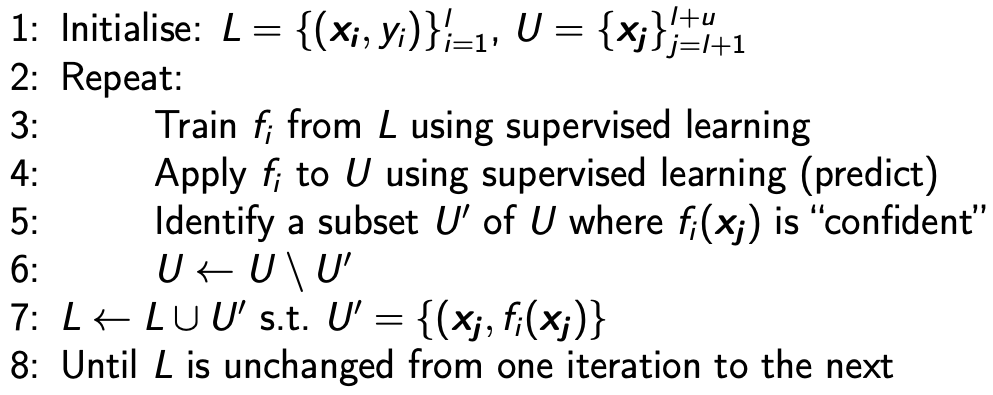

## Classifier Combination

- Constructs a set of base classifiers from a given set of training data and aggregates the outputs into a single meta-classifier
- Why it works?
  - Suppose error rate $\epsilon = 0.35$  and base classifier are independent
  - $pbinorm(25,13) \approx 0.06 $ 

### Voting

- Run multiple base classifiers over the test data and select the class predicted by the most base classifiers
- Continuous data could use average

### Stacking

- Smooth errors over a range of algorithms with different biases
- **<u>Meta-classification</u>** (training a classifier over the outputs of the based)
  - Train using nested cross validation to reduce bias
- Mathematically simple but computationally expensive method
- Able to combine heterogeneous classifiers with varying performance
- Usually as good or better results than the best of the base classifiers

### Bagging

- Basic intuition
  - The more data, the better the performance
- Approach
  - Randomly sample the original dataset N times, **<u>with replacement</u>**
  - We get a new dataset of the same size, where any individual is absent with probability $(1 - \frac{1}{N})^N$
  - Construct k random datasets fro k base classifiers
  - Prediction made by voting
- Pros
  - Simple
  - Possibility to parallelise computation of individual base classifiers
  - Highly effective over noisy datasets (outliers may vanish)
  - Performance is generally significantly better than the base classifiers and only occasionally substantially worse

### Random Forests

- Random Tree
  - DT where at each node, only some of the attributes are considered
  - Control for unhelpful attributes
  - Much faster but increase variance
- RF
  - An ensemble of random trees
  - Each tree is built using a different **<u>bagged training dataset</u>**
  - Idea
    - Minimise overall model variance without introducing model bias
- Hyper-parameters
  - Number of trees
    - Tuned based on **<u>out-of-bag error rate</u>**
    - For each bootstrap sample taken from the training data, there will be samples left behind were not included. These samples are called Out-Of-Bag samples or OOB.
  - ==Feature sub-sample size==
    - Bootstrape maybe (similar as bagging)
- Pros
  - Strong performer
  - Parallelisable
  - Efficient and robust to overfitting
- Cons
  - Interpretability sacrificed

### Boosting

- Tune base classifier to focus on the “hard to classify” instance
- Iteratively change the distribution and weights of training instances to reflect the performance of the classifier on the previous iteration.
  - Start with a uniform distribution
  - Over T iterations, train a classifier and update the weight of each instance according to whether it is correctly classified
  - Combine the base classifiers via weighted voting
- Overview
  - It is mathematically complicated but computationally cheap method based on iterative sampling and weighted voting
  - More computationally expensive than bagging
  - Guaranteed performance in the form of error bounds
  - Trends to overfit
- Bagging/RF v.s. Boosting
  - 

## Semi-supervised Learning

### Clustering

- Unsupervised learning
- Basic contrasts
  - Exclusive v.s. overlapping clustering
  - Deterministic v.s. probabilistic clustering
  - Hierarchical v.s. partitioning clustering
  - Incremental v.s. batch clustering
- K-means
  - Soft k-means clustering
    - Randomly initialise the centroids
    - Using softmax to calculate the distance
      - $z_{ij}=\frac{\exp[-\beta||x_j-\mu_i^t||]}{\sum_l\exp[-\beta||x_j-\mu_I^t||]}$
      - Small $\beta$, softer
      - Large $\beta$, harder
    - Update centorids
      - $\mu_i^{t+1}=\frac{\sum_jz_{ij}x_j}{\sum_jz_{ij}}$
  - Clustering via Finite Mixture
    - A finite mixture is a mixed distribution with k component distributions
  - Use EM(expectation maximisation) to solve the k-mean problem
    - Quasi-Newton parameter estimation method with guaranteed “positive” hill-climbing
    - Used to estimate (hidden) parameter values or cluster membership
    - Basic idea
      - **<u>E</u>** : calculated the expected log-likelihood based on the current estimate of the parameters
      - **<u>M</u>**: compute the new parameter distribution that maximise the log-likelihood
    - Measure Convergence
      - Since we have the log likelihood for a given finite mixture, once the measure below a certain level, we can consider the estimate to have converged.
    - Advantages
      - Guaranteed “positive” hill climbing behaviour
      - Fast to converge
      - Results in probabilistic cluster assignment
      - Simple but powerful method
    - Disadvantages
      - Possibility of getting stuck in a local maximum
      - Still rely on arbitrary k
      - Tends to overfit if “over-trained”

### Cluster Evaluating

- Unsupervised
  - High cluster separation
    - Distinction between different clusters
    - $separation(C_i, C_j) = \sum\limits_{x\in C_i, y \in C_{j \neq I}} proximity(x,y)$
  - High cluster cohesive
    - Close within a cluster
    - $cohesion(C_i) = \frac{1}{\sum\limits_{x,y\in C_i}Proximity(x,y)}$
  - SSE
    - $SSE=\sum\limits^k_{i=1}\sum_\limits{x\in C_i}proximity(x,c_i)^2$
    - Often use Euclidean distance for the proximity measure
    - For nominal attributes, we could use hamming distance
- Supervised
  - How well do cluster labels match externally supplied class labels
  - $purity=\sum^K_{i=1}\frac{|C_i|}{N}\max_jP_i(j)$
  - $entropy=\sum^K_{i=1}\frac{|C_i|}{N}H(x_i)$
  - 
    - Where 0.67 = max(8,4) / 12
- Semi-supervised Learning
  - Training data = $I$ labelled instance $\{(x_i, y_i)\}$
  - And $u$ unlabelled instances {$x_j$}, often u $\gg$ I
  - Goal
    - We want learn a better classifier $f$ from I and u rather than I alone
  - Why?
    - Labelling data can be expensive
  - Self training (bootstrapping)
    - 

- Active Learning
  - It assumes that a classifier can achieve higher accuracy with few training instances
  - Query Strategies
    - Least confident instances
    - Margin sampling $\to$ find max entropy $\to $ the one with most uncertainty
    - Query-by-committee (QBC)
      - Instance where there is the highest disagreement is selected for querying
  - Robust, but biased towards a particular class set and learning approaches, and highly reliant on “clean” labelling